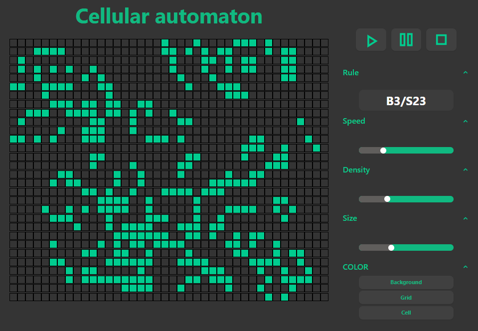

<p align="center">
  
</p>

<div align="center">

<h2>Beta demo available at <a color="#01CC8F" href={https://main--celluar-automaton.netlify.app/}>https://main--celluar-automaton.netlify.app/</a></h2>
</div>

<p align="center">
  <strong>Welcome to the cellular automaton. Created with TopeScript, React, Tailwind.</strong>

  
</p>

## Getting Started

First, run the development server:

```bash
npm run dev
# or
yarn dev
# or
pnpm dev
```

Open [http://localhost:5173/](http://localhost:5173/) with your browser to see the result.

You can start editing the page by modifying `App.tsx`. The page auto-updates as you edit the file.

# Learn More

## React + TypeScript + Vite

This template provides a minimal setup to get React working in Vite with HMR and some ESLint rules.

Currently, two official plugins are available:

- [@vitejs/plugin-react](https://github.com/vitejs/vite-plugin-react/blob/main/packages/plugin-react/README.md) uses [Babel](https://babeljs.io/) for Fast Refresh
- [@vitejs/plugin-react-swc](https://github.com/vitejs/vite-plugin-react-swc) uses [SWC](https://swc.rs/) for Fast Refresh
